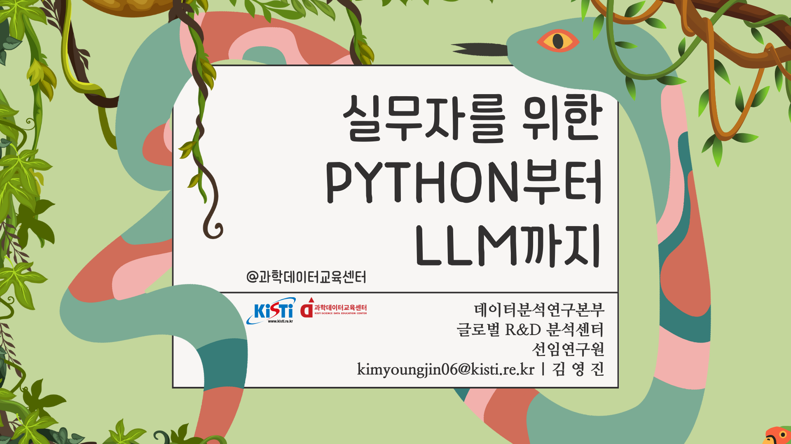

# 2025 KISTI python Lecture

- 2025.03.26 - 2025.03.28 (18h; 6h * 3d)
- @Science Data Education Center, KISTI Seoul office
- Young Jin Kim | kimyoungjin06@kisti.re.kr
- Lecture: [Canva Link](https://kimyoungjin06.my.canva.site/2025-kisti-lecture)
- Last Update: 2025.03.27
> 본 강의의 목표는 코드 한 줄 한 줄을 정확하게 전달하기 보다는 ** LLM 시대**에 걸맞게, LLM을 통해 코드를 작성하고, 최적화 하고, 향후 재사용 하기 위해, 주석, 타입힌트 등을 잘 만들어 놓는 것을 목표로 합니다. 또한, 최대한 LLM을 괴롭혀서(?), 개인의 시간 소비를 줄이는 생산성 극대화의 접근을 권장하는 입장에서 만들었습니다. - 김영진

